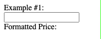
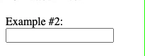
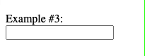

# curFormatter
JavaScript formatter Rupiah currency

Berikut adalah beberapa contoh penggunaan `curFormatter.js` untuk mengkonversi nilai input ke format mata uang Rupiah (Rp ). 
>Contoh penggunaan script ini secara lengkap bisa dilihat pada [example.html](example.html)

# Example #1


**HTML**

```html
<div id="example-1">
	Example #1:<br>
	<input type="text" id="price1" name="price1"><br>
	Formatted Price: <span id="formatted_price1"></span>
</div>
```

**JavaScript**

```javascript
// initialize
let formatter = new curFormatter();

// Example #1
let price1 = document.getElementById('price1');
price1.addEventListener('keyup', function(e) {
    let formatted_price = formatter.formatRupiah(price1.value, 'Rp ');
    document.getElementById('formatted_price1').innerHTML = formatted_price;
});
```
Pada contoh ini `curForematter.js` memiliki fungsi `formatRupiah(nominal, format)` untuk mengkonversi parameter **nominal** dengan **format** mata uang tertentu seperti rupiah (Rp )
> **NB**: Penggunaan contoh ini bisa diterapkan pada program kasir misalnya untuk menampilkan kalkulasi diskon, subtotal, dll. 

# Example #2


**HTML**

```html
<div id="example-2">
	Example #2:<br>
	<input type="text" id="price2" name="price2"><br>
</div>
```
**JavaScript**

```javascript
// initialize
let formatter = new curFormatter();

// Example #2
formatter.input('#price2', 'Rp ');
```
Pada contoh ini menggunkan fungsi `formatter.input(formatted_element, format)` dimana parameter **formattted_element** bisa diisi dengan **id/class** input dan **format** diisi dengan nama mata uang (Rp ).
> **NB**: Penggunakan contoh ini pada form submit kurang efektif karena harus dikonversi ulang (reverse) di backend untuk mendapatkan nominal asli jika ingin disimpan ke database (Not Recommended)

# Example #3


**HTML**

```html
<div id="example-3">
	Example #3:<br>
	<input type="hidden" id="price3" name="price3">
	<input type="text" id="formatted_price3" name="formatted_price3"><br>
</div>
```
**JavaScript**

```javascript
// initialize
let formatter = new curFormatter();

// Example #3
formatter.input('#formatted_price3', 'Rp ', '#price3')
```
Berbeda dengan Example #2, pada contoh ini terdapat penambahan parameter `element_ori` pada fungsi `formatter.input(formatted_element, format, element_ori)` dan pada html terdapat 2 input dimana element input `'#price3'` bertipe *hidden*
> **NB**: Penggunakan contoh ini cukup baik untuk form submit dimana ketika disubmit akan mengirim 2 parameter yaitu input dari (**formatted\_price3**) dan element_ori (**price3**) yang bertipe *hidden* (Recommended)